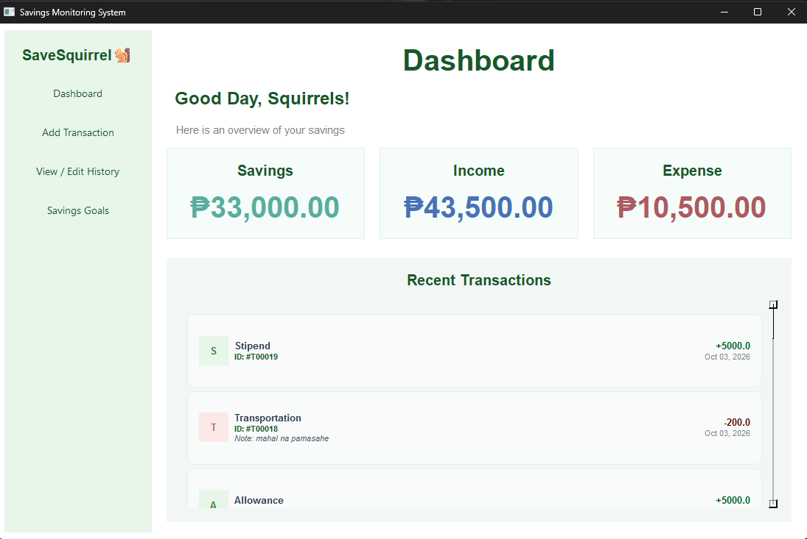
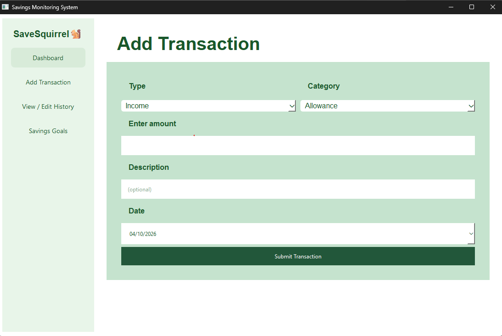
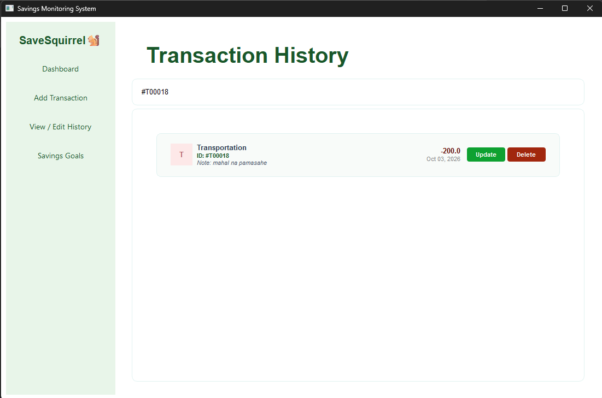
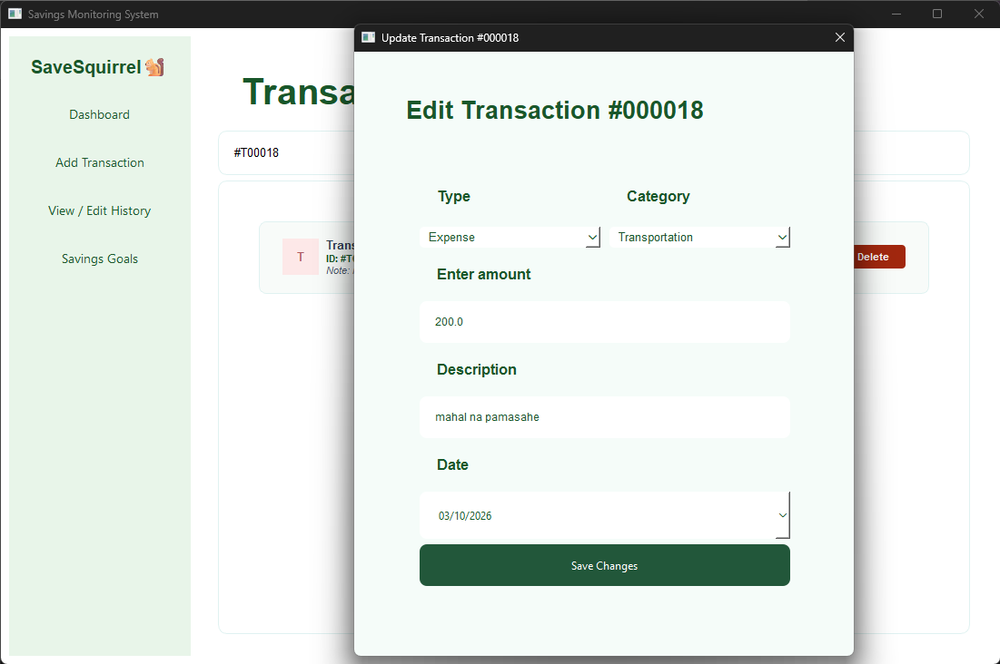
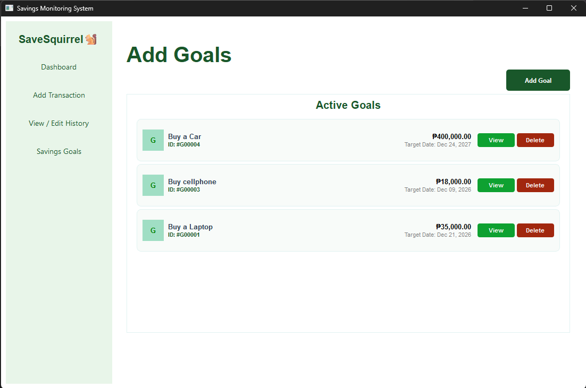

# SaveSquirrel🐿
 Savings Monitoring & Goal Tracking System
## Project Description
 SaveSquirrel is an application that works on a personal computer for the tracking of finances and aims at monitoring personal savings, income, expenses, and future financial goals in real time.

 Individuals often struggle to track daily personal expenses and income streams. Without a dedicated tool, cash flows become unorganized, leading to overspending and difficulties in maintaining savings and budgeting money. SaveSquirrel addresses this problem by offering a unified interface to log financial transactions, categorize earnings and spendings, compute overall net savings dynamically, maintain a searchable transaction history, and set target savings goals with deadline tracking.

## Project Objectives
 - Provide a user-friendly desktop application for monitoring personal income and expenses.
 - Automate net savings calculations derived from logged transactions.
 - Enable goal management to let users set, view, and track target goals.
 - Support dynamic transaction management, including addition, editing, deletion, and searching.
 - Ensure data persistence across transactions and savings goals using a local database architecture.

## Features
- **Dashboard Overview:** 
 Displays current total income, expenses, dynamic net savings, and display of the 20 most recent transactions.
- **Savings Transaction Logging:** 
  Add new income or expense transactions with dependent category selections (e.g., Allowance, Salary, Transportation, Food), custom amounts, optional descriptions, and dates.
- **Edit Transaction History & Search History:** 
  View all past transactions with search functionality to filter entries instantly by category or transaction ID. Update or delete individual transaction records directly through dedicated GUI dialogs, automatically syncing changes across the system.
- **Savings Goals Management:** 
  Set savings goals with custom target goal titles (e.g., Buying a Laptop), set target amounts, and target completion dates. View and manage active savings goals include displaying remaining days and needed amounts. Users can also remove or delete savings goals.

## Technologies Used
- Programming Language: Python
- GUI Framework: PyQt6
- Database: SQLite (sqlite3)
- Standard Python Libraries: pathlib, dataclasses, sys, datetime 


## Project Structure
```text
SaveSquirrel/
│
├── database/
│   └── savings_database.py          # SQLite database connection & schema creator
│
├── features/
│   ├── dashboard/
│   │   ├── model2.py                # SavingsDashboard metric entity
│   │   ├── service2.py              # Financial totals calculation service
│   │   └── dashboard_page_view.py   # PyQt6 UI view for Dashboard summary
│   │
│   ├── savings_goal/
│   │   ├── model3.py                # SavingsGoal dataclass entity & validations
│   │   ├── repository3.py           # Goals SQL database execution repository
│   │   ├── service3.py              # Savings goal business logic & remaining calculations
│   │   └── savings_goal_view.py     # PyQt6 UI view for Savings Goals page & dialogs
│   │
│   └── savings_management/
│       ├── model.py                 # Savings transaction dataclass entity
│       ├── repository.py            # Savings SQL database execution repository
│       ├── service.py               # Transaction business logic & input validation
│       ├── transaction_page_view.py # PyQt6 UI form view for adding transactions
│       └── history_page_view.py     # PyQt6 UI view for viewing/filtering/editing history
│
└── main.py                          # Main entry point & QMainWindow sidebar navigation

```
### Purpose of Major Files

#### database/savings_database.py:
- Manages SQLite connections and executes CREATE TABLE IF NOT EXISTS scripts for savings and goals.

#### features/dashboard/:
- **model2.py**: Encapsulates private attributes for income, expense, and net savings. 
Use getters method for accessing private attributes(Read-Only).
- **service2.py**: Fetches transactions and computes income totals, expense totals, and savings net balance.
- **dashboard_page_view.py**: Renders the main dashboard cards and recent transaction feed.

#### features/savings_goal/:
- **model3.py**: Dataclass enforcing non-empty fields and validated target amounts for savings goals.
- **repository3.py**: Handles SQL insertion, fetching, and deletion queries for goals.
- **service3.py**: Computes remaining days to goal dates and remaining amounts needed.
- **savings_goal_view.py**: Renders active goal cards, goal creation modal dialogs, and goal details view(UI).

#### features/savings_management/:
- **model.py**: Dataclass storing individual transaction fields (trans_type, category, amount, description).
- **repository.py**: Executes SQL statements for adding, reading, updating, and deleting transactions.
- **service.py**: Enforces positive monetary amount validations and formats transaction history.
- **transaction_page_view.py**: Provides form UI with dependent combo boxes for logged entries.
- **history_page_view.py**: Renders interactive cards for past transactions with live search filtering.

#### Root File:
- **main.py**: Sets up QApplication, initializes database/repositories/services, constructs the sidebar navigation.

## Installation and Setup
### Prerequisites
Before running the project, install:
- **Python 3.10** or higher
- **PyQt6**
- **PyCharm** or another Python IDE

### Instructions

1. **Clone the Repository**
   ```bash
   git clone <YOUR_GITHUB_REPOSITORY_LINK>
   ```
2. **Open the Project**
   Open the `SaveSquirrel` project folder in PyCharm or another Python IDE.

3. **Set Up Virtual Environment(Optional but Recommended)**
   ```bash
   python -m venv .venv
   
   #On windows 
   .venv\Scripts\activate
   #On macOS/Linux
   source .venv/bin/activate
   ```
   if your using PyCharm, you do not need to set up VE.
4. **Install PyQt6**
   Open the terminal inside the project and run:
   ```bash
   pip install PyQt6
   ```

5. **Check the Project Structure**
   Make sure the folders/directories and Python files retain their package structure:
   - `database/`
   - `features/`
   - `dashboard/`
   - `savings_management/`
   - `savings_goal/`
   - `main.py`

6. **Run the Application**
   Run the main script in your terminal:
   ```bash
   python main.py
   ```
The application should create the SQLite database file when the database component is initialized.

## How to Use the System

### 1. Dashboard Overview
Launch the application to immediately view your net balance, total income, total expenses, and the latest transaction activity feed.

### 2. Adding a Transaction
Follow these steps to log a new record:
1. Click the `+ Add Transaction` button on the sidebar.
2. Select the transaction type (`Income` or `Expense`) from the first combo box.
3. Choose a corresponding category from the dynamic dropdown combo box.
4. Enter the amount, add an optional description, and select the transaction date.
5. Click `Submit Transaction` and confirm the action in the prompt.

### 3. Viewing History & Editing
To audit or modify your past records:
1. Click `View / Edit History` on the sidebar.
2. Use the search bar at the top to filter transactions instantly by **category name** or **transaction ID** (e.g., `#T00010`).
3. In the history table list, click `Update` to modify transaction details, or click `Delete` to completely remove the transaction.

### 4. Managing Savings Goals
To track and monitor your milestones:
1. Open the `Savings Goals` tab on the sidebar.
2. Click the `Add Goal` button to open the configuration dialog box.
3. Enter your **Goal Title**, **Target Amount**, and **Target Date**.
4. Click `Add Goal` to confirm and display your new goal card in the **Active Goals** list. 
5. Click `View` on any active card to track its deadline and see the remaining amount needed.
6. Click `Delete` on any goal card to remove it from the system.

## OOP Implementation

The system utilizes Object-Oriented Programming (OOP) concepts throughout its architectural layers to maintain clean, scalable, and modular code.

### Key Classes

- **`SavingsDatabase`**: Manages SQLite database instantiation and schema creation.
- **`Savings` & `Goal`**: Domain dataclass models storing transaction and target goal attributes.
- **`Dashboard`**: Data model representing aggregated income, expense, and net savings totals.
- **`SavingsRepository` & `GoalRepository`**: Data Access Objects (DAOs) executing parameterized SQL queries for persistent storage.
- **`SavingsService`**, **`DashboardService`**, & **`ServiceGoal`**: Service layer classes executing core business operations, calculations, and field validations.
- **`MainWindow`**: `QMainWindow` subclass organizing the main screen layout, sidebar menu, dependencies, and page navigation.
- **`DashboardPage`**, **`TransactionPage`**, **`HistoryPage`**, & **`SavingsGoalPage`**: Custom `QFrame` subclasses building the desktop UI views.


### OOP Principles Applied

#### 1. Encapsulation
- **Separation of Concerns**: The application is divided into distinct architectural layers (Database, Repository, Service, and View layers) to hide structural complexity.
- **Data Validation**: Internal data structures in `Savings` and `Goal` dataclasses format and validate data types immediately upon instantiation using the `__post_init__` method.
- **Access Control**: Restricts direct access to core financial data. For example, `Dashboard` hides internal values using private attributes (`__income`, `__expense`, `__savings`) with double-underscores and exposes read-only getter methods:
  - `get_income()`
  - `get_expense()`
  - `get_savings()`

#### 2. Inheritance
- **PyQt6 Widget Extension**: Class inheritance is heavily utilized to extend built-in GUI frameworks. 
  - `MainWindow` inherits from `QMainWindow`.
  - `DashboardPage`, `TransactionPage`, `HistoryPage`, and `SavingsGoalPage` inherit from `QFrame`.

#### 3. Polymorphism

## Database Architecture

The system utilizes an **SQLite** database backend, storing persistent data locally in the `savings_management.db` file.

### Database Schema (Tables)

#### 1. Table: `savings`
Stores all individual financial records, including income streams and expense logs.

| Column | Type | Constraints | Description |
| :--- | :--- | :--- | :--- |
| `id` | `INTEGER` | `PRIMARY KEY AUTOINCREMENT` | Unique transaction identifier |
| `type` | `TEXT` | `NOT NULL` | Transaction type (`"Income"` or `"Expense"`) |
| `category` | `TEXT` | `NOT NULL` | Category name (e.g., Salary, Food) |
| `amount` | `REAL` | `NOT NULL` | Transaction monetary amount |
| `description` | `TEXT` | *Optional* | Additional notes or details |
| `date` | `TEXT` | `NOT NULL` | Transaction date in `yyyy-MM-dd` format |

#### 2. Table: `goals`
Tracks user-defined short-term and long-term savings milestones.

| Column | Type | Constraints | Description |
| :--- | :--- | :--- | :--- |
| `id` | `INTEGER` | `PRIMARY KEY AUTOINCREMENT` | Unique goal identifier |
| `title` | `TEXT` | `NOT NULL` | Title/Name of the savings goal |
| `target_amount` | `REAL` | `NOT NULL` | Target monetary savings amount |
| `target_date` | `TEXT` | `NOT NULL` | Planned target date in `yyyy-MM-dd` format |


### Database Operations (CRUD)

The system isolates database communication inside the Repository layer using **parameterized SQL queries** to ensure memory safety and prevent SQL injection vulnerabilities.

* **Create (Insert)**: Handled by `SavingsRepository.add_transaction_list()` and `GoalRepository.add_goal()`. They execute `INSERT INTO` queries to add rows into the `savings` and `goals` tables, returning the auto-generated primary key IDs (`lastrowid`).
* **Read (Select)**: Handled by `SavingsRepository.get_all_transactions()` and `GoalRepository.get_all_goals()` using `SELECT ... ORDER BY id DESC` queries to fetch records sorted from newest to oldest.
* **Update**: Executed by `SavingsRepository.update_transaction()` using parameterized `UPDATE savings SET type=?, category=?, amount=?, description=?, date=? WHERE id=?` SQL statements.
* **Delete**: Executed by `SavingsRepository.delete_transaction()` and `GoalRepository.delete_goal()` using `DELETE FROM ... WHERE id = ?` queries to remove selected rows cleanly.
* **Search / Filter**: Performed dynamically via `HistoryPage.filter_history()`. This queries memory-cached database lists to instantly match user input string filters against categories or formatted text IDs (e.g., `#T00001`).

## Screenshots

### Dashboard Page: 
Displays total savings, income, expense summary cards, and the top 20 recent transactions.

### Add Transaction page:
Displays the form for inputting transaction type and category (using dependent comboboxes), amount, descriptions, and date.

### View & Edit History page:
Displays searchable list of logged transactions with update and delete buttons.

Pop up dialog for updating a transaction

### Savings Goal Page:
 Displays active target savings cards and goal dialog popups plus view and delete buttons. Can view and track goal deadlines and needed amount.

The pop up dialog for creating or adding a new goal.

## Testing

| Test Case / Feature | Inputs                                                                                   | Expected Result                                                                                   | Actual Result                                                | Status |
| :--- |:-----------------------------------------------------------------------------------------|:--------------------------------------------------------------------------------------------------|:-------------------------------------------------------------| :--- |
| **Add Valid Transaction** | **Type:** Income<br>**Category:** Salary<br>**Amount:** `1500`<br>**Date:** `2026-05-01` | Transaction saves successfully; totals and history update.                                        | Transaction saved to database and UI updated.                | Pass |
| **Add Invalid Amount** | **Amount:** `-50` or `"abc"`                                                             | Displays warning dialog: *"Amount must be a valid number."* or *"Amount must be greater than 0."* | Warning dialog displayed; invalid input blocked.             | Pass |
| **Add Valid Savings Goal** | **Title:** `"Buy Laptop"`<br>**Target Amount:** `35000`<br>**Date:** `2026-12-31`        | Goal saves successfully and renders card under Active Goals.                                      | Goal saved and active goal card rendered.                    | Pass |
| **Add Empty Goal Title** | **Title:** `""`<br>**Target Amount:** `5000`                                             | Raises `ValueError` / Warning dialog: *"goal Title cannot be empty"*.                             | Warning dialog displayed; submission halted.                 | Pass |
| **Search Filter** | **Search query:** `"Food"`                                                               | Displays only transactions matching category *"Food"*.                                            | List filtered dynamically to show matching entries.          | Pass |
| **Delete Transaction / Goal** | Click **Delete** on Transaction ID `#T00001` or Goal ID `#G00001` & confirm              | Item deleted from database and removed from UI frame list.                                        | Confirmation prompted; record deleted from DB and UI frames. | Pass |
| **Update Transaction** | Change amount from `100` to `200`                                                        | Database entry updates, dashboard totals reflect new amount.                                      | Database entry updated and total metrics recalculated.       | Pass |

## Known Issues / Limitations
* **Fixed Window Size:** The application window layout uses fixed minimum dimensions, which may limit responsive scaling on screens with lower resolutions.
* **Search Scope:** Transaction search filters specifically by category name and transaction ID rather than performing full-text searches on transaction descriptions.
* **Missing Progress Visualizer:** The project does not currently show a separate goal-progress percentage or progress bar on active savings goal cards.
* **Lack of Notifications:** There is no automated notification or alert system to remind users of upcoming goal target dates or progress updates.
* **Hardcoded Currency:** Currency values are explicitly rendered with the Philippine Peso symbol (`₱`) across UI labels and modals; multi-currency selection or locale configuration is not yet implemented.
* **Fixed Category Structure:** Category options are populated from a static dictionary structure in `transaction_page_view.py`. User-defined custom categories cannot be dynamically added to the dropdown menu.
* **Data Export / Import:** The system does not currently support exporting or importing financial history reports to/from external formats such as CSV, Excel, or PDF.

## Author
Sophia Margaret B. Madronero